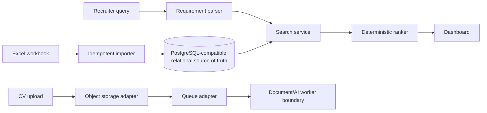

# Candidate Intelligence Architecture

## Problem and assumptions

Recruiters need a trustworthy shortlist from millions of heterogeneous CVs. The supplied workbook is a legacy master source and is the MVP seed. The MVP assumes one organization, local development storage, and a 1,000-row seed; it does not claim production-scale infrastructure.

## MVP implementation

The repository defaults to SQLite for zero-friction local setup, while SQLAlchemy keeps the model PostgreSQL-compatible. Production should use PostgreSQL, Alembic migrations, object storage, and a managed queue. Search and ranking are service boundaries so OpenSearch and a vector index can replace the local implementation without changing API contracts.

## Data model

`Candidate` owns stable identity and structured attributes. Skills, education, documents, and notes are separate entities. `Organization` scopes every candidate and audit record for tenant isolation. `ImportBatch` records source and row count. `AuditLog` records actor, candidate, action, provenance, and decision details. Documents store only a storage key, never binary CV content in PostgreSQL.

## Search and ranking

Natural language is converted locally into validated recommendation requirements with regular expressions and normalization aliases. Hard constraints are applied first: location, experience, salary, and notice. The MVP uses only fields present in the master workbook; skills mentioned in a query are reported as unsupported until a trusted skill source is loaded. Production retrieval can combine PostgreSQL/OpenSearch lexical retrieval with cached embeddings for role and experience similarity. Retrieval and ranking remain separate.

The recommendation score is deterministic and configurable: 25% position, 25% experience, 15% industry, 15% location, 10% salary, and 10% notice period. Only criteria present in the request contribute, with weights redistributed proportionally. The API exposes the complete score breakdown, matched criteria, concerns, and a template-based explanation. No LLM or API key is required.

The current workbook has no trusted skills or seniority columns. Queries mentioning AI, Python, LLMs, or seniority therefore preserve those requirements as explicit concerns instead of inventing candidate skills or silently treating every candidate as a match. CV-derived skills can be added to the same scoring contract later.

## Production scale

For 10M+ candidates and 20M+ documents: stateless horizontally scaled FastAPI instances sit behind a load balancer; CV binaries live in S3/Azure Blob/GCS behind signed URLs; Kafka/SQS/Service Bus carries ingestion events; autoscaled worker pools perform parsing, OCR, extraction, identity resolution, and embedding. PostgreSQL remains the transactional source of truth with tenant-aware indexes, partitioning where justified, read replicas, and an outbox for index updates. OpenSearch handles lexical/hybrid retrieval; a vector service or pgvector handles embeddings. Redis provides short-lived query/cache/rate-limit state. CDN serves only authorized, temporary document URLs.

Reindexing is versioned and incremental: write a new index, replay the change log, validate counts, then atomically switch an alias. Backups, point-in-time recovery, multi-zone deployment, queue replay, and disaster-recovery runbooks protect the source of truth.

## Trade-offs

- PostgreSQL is strong for transactional integrity, relational profile data, tenant boundaries, and a simple MVP; OpenSearch is better for high-volume faceting and retrieval.
- Vector search captures role similarity and synonyms, but is less predictable for hard constraints and adds embedding cost, so it supplements filters rather than replacing them.
- Asynchronous CV processing prevents upload timeouts and isolates expensive work; a queue adds operational complexity but enables retries and backpressure.
- Object storage is cheaper and safer for binary documents than relational blobs and supports lifecycle policies.
- Agents are used for intent, extraction, and change proposals; normal services handle CRUD, filters, authorization, and scoring.
- Human approval is mandatory for uncertain identity matches and profile mutations to prevent silent false merges.

## MVP versus production

The MVP has one tenant, SQLite default, local API process, a lightweight background-task boundary, and deterministic query parsing. Production adds real authentication, RBAC middleware, queue workers, OCR, LLM providers, embeddings, OpenSearch, object storage, secret management, rate limits, and full telemetry. These are interfaces and documented evolution paths, not deployed claims.
